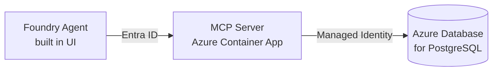

# Azure PostgreSQL MCP Server — one-command deploy

Deploy the **Azure Database for PostgreSQL MCP server** onto Azure Container Apps (ACA) so a **Foundry agent** can query your database in natural language.

This fork is trimmed down for one specific scenario:

> ✅ You **already have** a Foundry project and an Azure Database for PostgreSQL.
> ✅ You will **build the agent yourself in the Foundry portal (UI)**.
> ✅ You only need to **deploy the MCP server (ACA)** and wire up permissions.

You don't edit any files. `azd up` asks you two questions, deploys everything, and then prints the exact copy/paste steps to finish.

---

## What gets deployed

| Resource | Purpose |
| --- | --- |
| Azure Container App (+ environment) | Hosts the Azure MCP PostgreSQL server image |
| Entra ID App Registration | Authenticates incoming requests to the MCP server |
| Role assignment: ACA → Postgres | Lets the MCP server read your database (Reader) |
| Role assignment: Foundry MI → Entra App | Lets your existing Foundry project authenticate to the MCP server |

Application Insights is **off by default**. Your existing Foundry project and PostgreSQL server are **not modified** (only role assignments are added).



---

## Prerequisites

- [Azure CLI](https://learn.microsoft.com/cli/azure/install-azure-cli) and [Azure Developer CLI (azd)](https://learn.microsoft.com/azure/developer/azure-developer-cli/install-azd)
- A [PostgreSQL client](https://www.postgresql.org/download/) (`psql`) — used once to grant the MCP server database access
- Two resource IDs (copy from the Azure portal → your resource → **JSON View** → **Resource ID**):
  - Your **PostgreSQL Flexible Server** resource ID
  - Your **Foundry project** resource ID

---

## Deploy (3 commands)

```bash
az login
azd auth login
azd up
```

On `azd up` you'll be prompted for:

| Prompt | What to paste |
| --- | --- |
| `AZURE_LOCATION` | The region to deploy the MCP server into |
| `POSTGRES_RESOURCE_ID` | `/subscriptions/.../flexibleServers/<server>` |
| `AIF_PROJECT_RESOURCE_ID` | `/subscriptions/.../accounts/<account>/projects/<project>` |

> azd remembers your answers, so re-running `azd up` won't ask again. To change them later: `azd env set POSTGRES_RESOURCE_ID "<new-id>"`.

Deployment takes **1–2 minutes**. When it finishes, azd automatically prints a **"TWO STEPS LEFT"** summary with all the values already filled in for you. Follow it. (You can reprint it anytime with `azd hooks run postprovision`.)

---

## Step 1 — Grant the MCP server access to your database

The summary gives you the exact commands with your container app's identity name already inserted. In short:

1. Connect to your Postgres server with `psql` using **Entra ID** auth:
   ```bash
   export PGHOST=<your-database-host>
   export PGUSER=<your-admin-username>
   export PGPORT=5432
   export PGDATABASE=postgres
   export PGPASSWORD="$(az account get-access-token --resource https://ossrdbms-aad.database.windows.net --query accessToken --output tsv)"
   psql
   ```
2. In the **`postgres`** database, create the principal for the MCP server's managed identity:
   ```sql
   SELECT * FROM pgaadauth_create_principal('<CONTAINER_APP_IDENTITY_NAME>', false, false);
   ```
3. In the database that holds **your tables**, grant read access:
   ```sql
   GRANT SELECT ON ALL TABLES IN SCHEMA public TO "<CONTAINER_APP_IDENTITY_NAME>";
   ALTER DEFAULT PRIVILEGES IN SCHEMA public GRANT SELECT ON TABLES TO "<CONTAINER_APP_IDENTITY_NAME>";
   ```
   > Repeat for any non-`public` schema you want the agent to read.

> The `<CONTAINER_APP_IDENTITY_NAME>` is printed for you. You can also get it with `azd env get-value CONTAINER_APP_IDENTITY_NAME`.

---

## Step 2 — Add the tool to your agent in the Foundry portal

1. Open your project in the **Foundry portal** and open (or create) your agent.
1. **Tools** → **Add** → **Add a new tool** → **Catalog** tab.
1. Choose **Azure Database for PostgreSQL** → **Create**.
   
1. Click **Connect tool with endpoint** and enter the values from the printed summary:
   - **Remote MCP Server endpoint** → `CONTAINER_APP_URL`
   - **Authentication** → **Microsoft Entra** → **Project Managed Identity**
   - **Audience** → `ENTRA_APP_CLIENT_ID`
   
1. **Save**.
1. Paste the agent instructions from the printed summary (server / resource-group / subscription / user are pre-filled; you fill in `<DATABASE_NAME>` and `<TABLE_NAME>`):
   ```
   You are a helpful agent that uses MCP tools to answer questions about the database.
   "parameters": {
       "database": "<DATABASE_NAME>",
       "resource-group": "<RESOURCE_GROUP>",
       "server": "<SERVER_NAME>",
       "subscription": "<SUBSCRIPTION_ID>",
       "table": "<TABLE_NAME>",
       "user": "<CONTAINER_APP_IDENTITY_NAME>"
   }
   ```
   
1. **Save** again.

> The "resource-group" / "server" are the ones containing your **PostgreSQL database** (even if the MCP server is in a different resource group). If you granted access to all tables, the `table` value is ignored.

---

## Test it

In the agent playground, try:

```
List all tables in my PostgreSQL database
```
```
Show me the latest 10 records from the orders table
```
```
Find customers who placed orders in the last 30 days
```

---

## Handy commands

```bash
azd env get-values            # show all outputs (URLs, IDs, identity name)
azd hooks run postprovision   # reprint the "TWO STEPS LEFT" summary
azd down                      # delete everything this deployment created
```

---

## Need the programmatic SDK client?

This fork assumes you build the agent in the UI. If you instead want to drive the agent from Python, see the sample in [`client/`](client/) and the upstream docs.

---

## Security notes

- The MCP server **requires Entra ID auth** for all incoming requests — never add `--dangerously-disable-http-incoming-auth`.
- External ingress is **HTTPS-only** (`allowInsecure: false`).
- The container's managed identity is granted only **Reader** on your Postgres server, and only **SELECT** at the database level.
